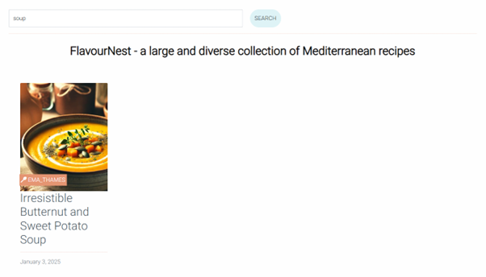

# FlavourNest - Milestone personal project


## Table of Contents

 1. [Overview](#overview)
     - [Purpose](#purpose)
     - [Target Audience](#target-audience)
 2. [User Stories](#user-stories)
     - [Must-Have User Stories](#must-have-user-stories)
     - [Should-Have User Stories](#should-have-user-stories)
     - [Could-Have User Stories](#could-have-user-stories)
 3. [Design and Databse Decisions](#design-decisions)
     - [Wireframes](#wireframes)
     - [Colours](#colours)
     - [Fonts](#fonts)
     - [Databse Design](#Database)
 4. [Features Implementation](#features-implementation)
     - [Core Features (Must-Haves)](#core-features-must-haves)
     - [Advanced Features (Should-Haves)](#advanced-features-should-haves)
     - [Optional Features (Could-Haves)](#advanced-features-should-haves)
 5. [Testing and Validation](#testing-and-validation)
     - [Testing Results](#testing-results)
         - [Bug Fixes](#bug-fixes)
         - [Responsiveness](#responsiveness)
         - [Lighthouse Performance Test](#lighthouse-performance-test)
         - [User stories Testing](#user-story-test)
     - [Validation](#validation)
 6. [Deployment](#deployment)
     - [Deployment Process](#deployment-process)
     - [File Structure](#file-structure)
 7. [ Tools Usage](#tools-usage)
     - [Tools Used](#Tools)
     - [ChatGPT](#chatgpt)
 8. [Reflection on Development Process](#reflection-on-development-process)
 9. [Code Attribution](#code-attribution)
 10. [Future Improvements](#future-improvements)

## Overview
<figure>
    
    <figcaption>FlavourNest</figcaption>
</figure>

### Purpose


FlavourNest serves as a comprehensive destination for food lovers passionate about Mediterranean dishes. The website is designed with the following purposes in mind:
<ul>
<li>
Sharing Mediterranean Recipes:  FlavourNest provides a variety of authentic Mediterranean recipes, from classic dishes to modern interpretations, catering to various dietary needs and preferences.
</li>
<li>
Engaging Mediterranean Food Community:  to create a space where Mediterranean food lovers can interact, share their cooking experiences, rate recipes, contact each other and leave reviews to foster a community of food enthusiasts.
</li>
<li>
Inspiration for All Skill Levels: Whether you’re a beginner or an experienced chef, FlavourNest offers easy-to-follow recipes and cooking tips that help users expand their cooking skills and knowledge of Mediterranean cuisine.
</li>
<li>
Personalized User Experience: The website allows users to create personalized profiles and search recipes a tailored cooking experience.
</li>
<li>
Dietary Inclusivity: We recognize the importance of catering to a variety of dietary preferences, and thus, FlavourNest ensures that every user can find recipes that suit their needs—whether they're vegetarian, gluten-free, or following any other dietary regimen.
</li>
<li>
Responsive and Accessible: Designed with user experience in mind, FlavourNest is built to be fully responsive across all devices, ensuring that users can access recipes, tips, and the community on-the-go.
</li>
</ul>
<br/>

***Here's my deployed site :*** [FlavorNest](https://flavornest-7cb17784f79b.herokuapp.com/)


## User Stories
In total , there is 12 user stories. 10 of them have been completed, while two couldn't be accomplished due to the lack of time.
Below is the project board and the project Table, illustrating all the user stories,that have been categorized into Must Have, Should Have, and Could Have,
to prioritize features based on their importance and relevance to the project.
 
<figure>
    
    <figcaption>Project Board</figcaption>
</figure>


<figure>
    
    <figcaption>Project Table</figcaption>
</figure>

 #### User Story 1 : Manage the Blog Posts

"As a Site user I can create, read, update and delete posts so that I can manage my profile content"


#### Acceptance Criteria 

1. **Create a Post:**
   - The Site user can create a new recipe post with a recipe_name, ingredients, image , instructions.
   - The post is published and visible on the homepage once approved.
   - The post can be categorized (e.g., breakfast, lunch, snacks).

2. **Update a Post:**
   - The Site user can update their posts, modifying the recipe_name, ingredients, image, or category.

3. **Delete a Post:**
   - The Site user can delete their post when necessary.

#### Tasks

##### 1. Design the Post Creation Form
   - The form should include input fields for:
     - Recipe Name
     - Ingredients
     - Instructions
     - Recipe Image
     - Cooking Time
     - Preparation Time
     - Category (e.g., Breakfast, Lunch, Vegan)
   - Form should allow file upload for images and provide validation for required fields.

##### 2. Implement the Backend (Model)
   - **Create Recipe Model:**
     - Define a `Recipe` model with fields:
       - `recipe_name` (CharField)
       - `slug` (SlugField)
       - `ingredients` (TextField)
       - `instructions` (TextField)
       - `recipe_image` (ImageField)
       - `status` ((0, "Draft"), (1, "Published"))
       - `category` (ForeignKey to Category model)
       - `author` (ForeignKey to User)
     - Define a `Category` model with categories like `breakfast`, `lunch`, `vegan`, etc.
     - Add necessary relationships between models (e.g., Recipe-Category, Recipe-User).

##### 3. Create the View for Post Creation
   - Handle both GET and POST requests for creating a post.
   - On POST, the data is saved to the database, with a default status of 'not approved' until approved by an admin.
   - Redirect to the post list page or show a success message after the post is saved.

##### 4. Display Posts on the Homepage
   - **View to Fetch and Display Posts:**
     - Show only posts where `status = 'published'` and are approved.
     - Display posts with basic details: title, category, and a thumbnail image.

##### 5. Create Recipe Detail Page
   - **View to Display Recipe Details:**
     - Show full content of the post with recipe details like ingredients and instructions.
     - Display the post image and show the author's name.

##### 6. Category Filter on Recipe Page
   - **Category Filter:**
     - Allow users to filter recipes by categories like `breakfast`, `lunch`, or `vegan`.
     - This can be implemented using a dropdown or clickable category filters at the top of the recipes page.

##### 7. Implement Edit Recipe Form
   - **Create Edit View:**
     - If the logged-in user is the author of the post, they should have the option to edit the post.
     - The form should pre-fill the current post’s data and allow editing of the title, content, image, and category.

##### 8. Add an Edit Button on Recipe Detail Page
   - **Edit Button Visibility:**
     - Display an "Edit" button only for the author of the post.

##### 9. Create a View to Handle Updating Recipes
   - **Update Recipe View:**
     - Allow the author to update their post using a form (pre-filled with current data).

##### 10. Add a Delete Button on the Recipe Detail Page
   - **Delete Button Visibility:**
     - Display a "Delete" button only for the author of the post.
     - When clicked, the post should be deleted from the database.

##### 11. Post Default Status on Creation
   - When a post is created, it is set to `draft` by default until it is approved by an admin.

##### 12. Admin Interface for Approval/Rejecting Posts
   - Create an admin interface to approve or reject posts based on the admin's review.
   - Admins can change the `status` of a post to `approved` or `rejected`.

##### 13. Design UI for Post Creation, Update, and Delete Pages
   - Ensure that the pages for creating, editing, and deleting posts are intuitive and user-friendly.
   - Provide clear forms with validation and appropriate success/error messages.

##### 14. Perform Manual Testing of the Entire Workflow
   - Test the process of creating, reading, updating, and deleting posts from the perspective of a site user.
   - Test admin approval/rejection process to ensure posts are correctly displayed when approved.
   - Test category filtering to ensure users can view posts by specific categories.

#### User Story 2: Open a recipe post

"As a site user, I can click on a recipe name so that I can read the full recipe content"

#### Acceptance Criteria:

- When a blog post recipe title is clicked on, a detailed view of the post is seen.
- User can print the recipe.

#### Tasks:

##### 1. **Create Recipe Detail View:**
   - Implement a view in Django that fetches the full recipe based on the recipe ID or slug.

##### 2. **Design Recipe Detail Page:**
   - Display the full content of the recipe:
     - Title
     - Ingredients
     - Instructions
     - Image
     - Category

##### 3. **Add a Print Button:**
   - Add a button or link on the recipe detail page to allow the user to print the recipe.

##### 4. **Ensure Proper URL Mapping:**
   - Define a URL pattern for the recipe detail page, passing the recipe ID or slug in the URL to fetch the correct recipe.

##### 5. **Add Styling for Print-Friendly Version:**
   - Implement a print-friendly layout that ensures the recipe is displayed properly when printed.

##### 6. **Test Recipe Detail and Print Functionality:**
   - Verify that clicking on a recipe title redirects the user to the correct recipe detail page.
   - Test the print button functionality to ensure the recipe can be printed correctly.

#### User Story 3 :Edit or delete a post
As a **Site User** I can **edit or delete a shared recipe** so that **I can manage my posts**


#### Acceptance Criteria

- Given a logged in user, they can modify their recipes
- Given a logged in user, they can delete their recipes

#### Tasks
1. **Recipe Edit Functionality:**
   - Create an edit form for recipes (pre-filled with current recipe data).
   - Implement a view to handle the editing of recipes.
   - Update the recipe in the database when the form is submitted.

2. **Recipe Delete Functionality:**
   - Implement a delete button on the recipe detail page.
   - Show a confirmation dialog before deleting.
   - Remove the recipe from the database upon confirmation.

3. **Access Control:**
   - Ensure that only the author of a recipe can modify or delete it.
   - Display an "Edit" button and "Delete" button only for the logged-in user who created the recipe.

4. **User Interface:**
   - Design an intuitive UI for editing and deleting recipes.
   - Provide feedback after the recipe has been edited or deleted.

5. **Testing:**
   - Test the editing process to ensure the changes are saved correctly.
   - Test the delete functionality to ensure recipes are removed from the database.
   - Test that unauthorized users cannot edit or delete recipes they do not own.

#### User Story 4: User Registration and Post Interaction

"As a Site User, I can register an account so that I can view, add, edit, comment, or rate a post."


#### **Acceptance Criteria**
- A user can register an account with an email and password.
- The user can log in after registering.
- When logged in, the user can view, add, edit, delete, comment on, and rate posts.


#### **Tasks**
1. **User Registration Form:**
   - Implement the registration form for email, password, and confirmation.
   - Handle form validation and user creation.

2. **User Login:**
   - Create login form for email and password authentication.
   - Implement session management for logged-in users.

3. **Post Management (View, Add, Edit, Delete):**
   - Allow users to add, update, and delete posts they create.
   - Ensure that users can only edit or delete their own posts.

4. **Rating and Commenting:**
   - Implement a rating system for posts.
   - Allow users to add comments to posts.

5. **Access Control:**
   - Ensure that only logged-in users can interact with posts.
   - Restrict editing and deleting to the post author only.

6. **UI/UX Design:**
   - Design interfaces for registration, login, and post interaction.
   - Ensure ease of access to the post interaction features.

7. **Testing:**
   - Verify the registration, login, and post interaction functionalities.
   - Test access control for post management.


#### User Story 5: View Reviews on an Individual Post

 As a **Site User / Admin**, I can **view reviews on an individual post** so that **I can read the conversation**.


#### **Acceptance Criteria**
- Any user can view the reviews on any recipe.
- A site user can read other users' reviews.
- A user is allowed to rate a recipe once.


#### **Tasks**
- Implement a review section on the recipe detail page.
- Ensure that users can see existing reviews for a recipe.
- Create functionality to allow users to submit a review.
- Limit each user to only one review per recipe.
- Design UI for displaying reviews in a readable format.
- Ensure that both site users and admins can view reviews.


#### User Story 6: Rate Blog Posts

 As a **site user**, I can **rate blog posts** so that **I can give feedback on how helpful or enjoyable the content is**.


#### **Acceptance Criteria**
- As a logged-in user, they can rate a blog post on a scale from 1 to 5 stars.
- The average rating for each blog post is displayed.
- The user can only rate each blog post once.


#### **Tasks**
- Implement a star rating system for blog posts.
- Store and update the ratings for each blog post.
- Calculate and display the average rating for each blog post.
- Prevent users from submitting more than one rating per blog post.
- Design the UI for the rating system.

#### User Story 7 : Search for Recipes by Keyword

 As a **site user**, I can **search for recipes by keyword** so that **I can easily find recipes**.


#### **Acceptance Criteria**
- The user can use a search bar to find posts by keywords.
- Relevant results are displayed based on the search criteria.


#### **Tasks**
- Implement a search bar on the recipes page.
- Integrate search functionality to filter posts based on keywords in the title, content, or category.
- Display search results dynamically.
- Ensure that results are relevant to the search query.

#### User Story 8 : Admin Approval or Disapproval of Posts

 As a **site admin**, I can **approve or disapprove users' posts** so that **I can filter out objectionable posts**.

#### **Acceptance Criteria**
- The admin can approve a post.
- The admin can disapprove a post.


#### **Tasks**
- Implement a post status field (approved, disapproved, pending) in the post model.
- Create admin interface to approve or disapprove posts.
- Display status of posts (approved/disapproved) in the admin dashboard.
- Allow admin to filter posts by approval status.

#### User Story 9 : Contact the Users
 As a **user**, I can **send a message to other users** so that **we can have a conversation**.

#### **Acceptance Criteria**
- Only authenticated users can send messages to other users.
- Logged-in users should have a form available to send messages to other users.
- The user should be able to send a message and see a success message after submitting.
- The system should display a list of registered users to choose from as recipients.


#### **Tasks**
- Implement a message model with fields for sender, recipient, and message content.
- Create a form for logged-in users to send messages to other users.
- Create a view to handle the message submission and display a success message.
- Display a list of registered users to select as recipients for the message.
- Ensure only authenticated users can access the message sending feature.

#### User Story 10 : Manage Profile

 As a **user**, I can **manage my profile** so that **I can change it as I wish**.

#### **Acceptance Criteria**
- A logged-in user can see their profile.
- A logged-in user can edit their profile.
- A logged-in user can delete their profile.


#### **Tasks**
- Create a user profile page where the logged-in user can view their details.
- Implement a form to allow users to edit their profile information.
- Implement functionality to update the profile details in the database.
- Create a delete profile feature that removes the user and their data.
- Ensure the user can only edit or delete their own profile.


#### User Story 11: Add Recipes to Favorites

As a **site user**, I can **add recipes to my favorites** so that **I can get back to them**.


#### **Acceptance Criteria**
- A logged-in user can add posts to their favorites.

#### User Story 12 : Share a recipe post externally

 As a **site user**, I can **share posts with my friends and family** so that **they can join the site**.


#### **Acceptance Criteria**
- The user can share recipe posts with their friends and family via a share link.
- The shared link directs others to the post or the site for registration.
- The system provides a way to easily share via social media, email, or direct link.

#### **Tasks**
- Implement a share button on recipe posts.
- Allow users to share via social media platforms (Facebook, Twitter, etc.), email, or copyable link.
- Ensure the shared link takes the recipient to the specific recipe post or sign-up page.
- Optionally, track how often posts are shared for analytics purposes.
## Design and DataBase Decisions


### UX  :

<br/>
For this recipe blog site. The user is meant to feel the ownership of the site. Each registered user has a profile, with a picture, his shared recipes , and a list of other users to be contacted.The User Profile has the same hero picture as a profile cover picture to keep up with the recurring theme.

FlavourNest colors are inspired by the ocean and the natural beauty of the Mediterranean. Ocean coral and ocean waves are perfect Mediterranean theme, as they evoke the feeling of the sea, fresh seafood, and coastal landscapes.

The site carrys a clean theme and the colors as nuetral as possible. One of the platform's main objectives is to share recipes with images. Images will have all different colors and composition therefore the need to reduce the noise and let the images be the focal point. The background body has been kept white with a blueish footer to frame the content, the crispy green tone of the navbar is to provide freshness and subtle to give the content precidence.

### Color Scheme ###
Hex: #FF6A3D -  Warm coral </br>
Hex: #1F6F8B -  Deep blue of ocean waves </br>
Hex:  #e59572 - Soft, earthy coral with hints of peach</br>
Hex: #FFFFFF -  White

***Colours Palettes***

<figure>
    
    <figcaption>Ocean Waves Color Palette.</figcaption>
</figure>
<figure>
    
    <figcaption>Ocean Coral Color Palette Color Palette.</figcaption>
</figure>


### Typography ###

<ol>
<li>Primary Font:
<ul>
<li>The ***'Roboto'*** font is used for the body text, ensuring readability with a clean, modern sans-serif style. This is a versatile and legible font that works well for both short and long text, making it perfect for the content-heavy blog.</li>
</ul>

<li>Font Weight and Sizes:
<ul>
<li>Headings and important text elements (such as .recipe-header, .cover-text h2, and .navbar-brand .brand) feature bold and larger font sizes to create clear visual hierarchy. The bold weights help emphasize key content like recipe titles and blog highlights, making them stand out to the reader.
</li>
<li>Subheadings and smaller text (like .cover-text p, .navbar-subtitle, and .star-rating .star) are given a lighter weight to provide contrast and guide the reader’s eye without overwhelming the layout.</li>
<li>Font sizes are adjusted responsively, scaling down for smaller screens, ensuring the design remains accessible and aesthetically pleasing across all devices.</li></ul>
<li>Heading Style:
<ul><li>
The main headings such as .recipe-header and .navbar-brand .brand are designed to capture attention with large font sizes, bold weights, and unique styling (such as the gradient background in .recipe-header). This creates an inviting atmosphere and ensures the key sections of the page are immediately noticeable.
</li></ul>
<li>Special Fonts:
<ul><li>
***'Mea Culpa*** is used for the blog’s brand title, providing a unique and personalized touch, fitting for the cultural and culinary context of a Mediterranean food blog.</li>
<li>The ***FontAwesome*** icon font is incorporated in the rating system (.star-rating), allowing for dynamic and interactive user elements such as stars for ratings.</li></ul>
<li>Text Alignment and Spacing:
<ul><il>
Text elements like .recipe-header and .cover-text are centered, providing symmetry and balance in key sections. Additionally, line-height and margin properties improve the readability of the content, ensuring the text isn't too cramped or difficult to read.</il></ul>
<li>Hover Effects:
<ul><il>
Links and buttons have interactive hover effects, changing color on interaction, such as in the .navbar a:hover and .btn:hover styles. These changes not only improve user experience but also create a dynamic visual flow as users navigate through the site.</il></ul>

<li>The favicon I made it using canvas</li></ol>

***Wireframes***


<p>To follow best practice, using Bootstrap (which is mobile-first), I decided to create the mobile wireframe, and then scale it up for larger screens.</p>

Balsamiq

Mobile Wireframes
 <figure>
    
    <figcaption>Mobile WireFrame.</figcaption>
</figure>


 ***Database Design***
Entity Relationship Diagrams (ERD) help to visualize database architecture before creating models. Understanding the relationships between different tables can save time later in the project.
Site used for ERD : </br>
 [Lucidchart](https://www.lucidchart.com/) 


## Features Implementation

### Core Features (Must-Haves)

1. **User Authentication and Authorization**
   - User registration and login system.
   - Password reset functionality.
   - User roles (Admin, Site User).
   
2. **User Profile Management**
   - View and edit profile (username, email, password, and profile picture).
   - Option to delete user profile.
   
3. **Recipe Management**
   - Users can create, view, update, and delete recipes.
   - Admins can approve or disapprove submitted recipes.
   - Ability to categorize recipes (e.g., breakfast, lunch, vegan).
   
4. **Admin Panel**
   - Admin can approve or reject submitted recipes.
   - Admin has the ability to manage user accounts (e.g., delete or block users).
5. **Responsive Design**
    - The website is fully responsive, ensuring usability on both mobile and desktop.
    - Optimized for quick loading and user-friendly interaction.

### Advanced Features (Should-Haves)

1. **Recipe Ratings and Reviews**
   - Users can rate recipes (1 to 5 stars).
   - Users can leave written reviews on recipes.
   - Display average ratings and reviews for each recipe.
2. **Search and Filter Recipes**
   - Search recipes by keyword or ingredient.

### Optional Features (Could-Haves)

1. **Messaging System**
   - Users can send messages to other users.
   - Messaging system allows conversation between users.
   
2. **Post Sharing**
   - Users can share recipes with friends and family via social media, email, or direct links.
3. **Favorites System**
   - Users can mark recipes as favorites.
   - A list of favorite recipes is available for users to view at any time.

## Testing and Validation

### Testing Results
#### Bug Fixes

During the development of FlavourNest Mediterranean recipe blog, several bugs and issues were identified and fixed to ensure smooth functionality and a better user experience. Below is a summary of the key fixes made to the CSS, HTML, Database, and Python for the app.

##### HTML Related

1. **Responsive Design Fixes**
   - Fixed issues where certain sections were not properly aligned on mobile devices.
   - Ensured that images and text scale properly across various screen sizes.
   - Added additional media queries for better responsiveness in header, footer, and content sections.

2. **Form Alignment**
   - Corrected misaligned form elements such as input fields, buttons, and labels in registration, login, and profile update forms.
   - Ensured that the "Sign Out" and "Cancel" buttons were placed correctly side by side in the confirmation dialog.
   - Ensured that "edit recipe" is properly populated with the original text instead of the HTML tag included.
3. **Navigation Menu**
   - Fixed the navigation bar to be fully responsive and ensure links are easily clickable on both desktop and mobile views.
   - Corrected dropdown menu functionality, ensuring they expand/collapse correctly on smaller screens.

4. **Buttons and Links**
   - Adjusted the styling for buttons and links to ensure they appear correctly (hover effects, color consistency, etc.).
   - Fixed broken links for profile, logout, and recipe pages.
   - Made sure the "Sign Out" button was positioned in the center of the confirmation dialog.

5. **Missing Images**
   - Corrected the issue where certain images (e.g., profile pictures, recipe images) were not loading due to missing or incorrect file paths in the HTML.
   - Added alt text for all images to improve accessibility.

##### CSS Related

1. **Fixed Layout Overflows**
   - Resolved page overflow issues, especially in the "recipe detail" view where content was being cut off on smaller screens.
   - Applied `overflow: hidden;` and adjusted width properties to ensure that content fits within its container.

2. **Improved Form Styling**
   - Improved the visual appearance of input fields, select dropdowns, and text areas to match the overall website design.
   - Applied consistent padding, margins, and font sizes for a better user experience.

3. **Hover Effects**
   - Fixed hover effects on buttons and links to enhance interactivity.
   - Ensured consistent hover states on buttons like "Sign Out" and "Share" buttons across various sections of the website.

4. **Custom Scrollbars**
   - Added custom scrollbars for better aesthetics and to match the website’s color scheme, especially in the recipe lists and message threads.

5. **Typography Improvements**
   - Adjusted font sizes for better readability across different devices, especially on mobile.
   - Fixed issues with inconsistent font usage on some pages.

##### Database Related

1. **Recipe Database Schema Fixes**
   - Resolved issues with recipe categorization, ensuring all recipes are correctly categorized and can be filtered.
   - Fixed an issue with missing or incorrect foreign key relations between recipes, users, and categories.

2. **Message System Bug**
   - Addressed a bug where messages were not being stored in the database correctly.

3. **User Profile Bug**
   - Resolved issues with the user profile not saving changes properly, especially when updating profile images.
   - Fixed errors related to empty profile fields after updates, ensuring that all profile changes are saved correctly.

##### Python (Backend) Related

1. **Recipe Approval Bug**
   - Fixed the recipe approval process, ensuring that only admin users could approve or reject recipe submissions.
   - Corrected issues where approved recipes were not displaying properly on the homepage.

2. **Authentication Bug**
   - Resolved an issue where logged-in users were occasionally redirected to the login page after performing certain actions, even if they were authenticated.
   - Resolve an issue where a deleted account email was stored still in the user table .

3. **Rating System**
   - Fixed a bug where users were able to rate the same recipe multiple times. Now users can only rate each recipe once.
   - Corrected the calculation of average ratings to ensure accurate data is shown on each recipe.

4. **Search Functionality**
   - Fixed search functionality to return relevant results based on keywords. The search now correctly filters recipes by title, ingredients, and category.
   
By addressing these bugs, we significantly improved the functionality, user experience, and overall performance of the FlavourNest Mediterranean recipe blog. These fixes ensure that users can seamlessly navigate, interact, and enjoy the platform.

#### Am I Responsive


#### Lighthouse Performance Test


#### User stories Testing
| User Story                        | FlavourNest App screenShot |
|-----------------                  |-----------------           |
| Manage the Blog Posts             |   
| Open a recipe post                |  |
| Edit or delete a post             |  |
| Account registration              |  |
| View reviews             |  |
|Rating a Blog Post             |  |
| Searching for Blog Posts             |  |
| Approve Posts            |  |
| Contact the User             |  |
| Manage my profile             |    |


### Validation

#### HTML Validation
HTML validation was achieved using the [W3C Validator](https://validator.w3.org/) which ensured the code met web standards.


#### CSS Validation
CSS validation was achieved using the [Jigsaw Validator](https://jigsaw.w3.org/css-validator/) which ensured the code met web standards.


#### Python Validation
Python validation was achieved using ***CI Python Linter*** validator.


## Deployment

### Deployment Process
#### Deployment Process to Heroku for FlavourNest

The live deployed application can be found deployed on :
[FlavourNest](https://flavornest-7cb17784f79b.herokuapp.com/)

This is the process followed to deploy **FlavourNest** Django application to **Heroku**:

#### 1. Prepare Django Application for Heroku

Before deploying, I made the necessary adjustments to my Django project.

   ##### a. Install Dependencies

Ensure that there is all the necessary dependencies for Heroku:

```
pip install gunicorn  whitenoise psycopg2 
```
After installing the dependencies, update your requirements.txt:
```
pip freeze > requirements.txt
```
   ##### b. Configure Django for Production

In the settings.py, made the following changes :

1. Database Configuration (PostgreSQL)

 ```
 DATABASES = {
    'default': dj_database_url.parse(os.environ.get("DATABASE_URL"))
}
```
2. Static File Handling with Whitenoise
```
MIDDLEWARE = [
    'django.middleware.security.SecurityMiddleware',
    'whitenoise.middleware.WhiteNoiseMiddleware',
    'django.contrib.sessions.middleware.SessionMiddleware',
    'django.middleware.common.CommonMiddleware',
    'django.middleware.csrf.CsrfViewMiddleware',
    'django.contrib.auth.middleware.AuthenticationMiddleware',
    'django.contrib.messages.middleware.MessageMiddleware',
    'django.middleware.clickjacking.XFrameOptionsMiddleware',
    'allauth.account.middleware.AccountMiddleware',
]
```
3. Secret Key
```
SECRET_KEY = 'django-insecure-+*******************
```
4. Allowed Hosts
```
ALLOWED_HOSTS = ["8000-mery369-flavornestproje-84m89s5cmly.ws.codeinstitute-ide.net",".herokuapp.com"]
```
5. Debug Mode
```
DEBUG = False
```
   ##### c. Create a Procfile
Created a Procfile in the root directory of my project to specify how to run the app on Heroku
   ##### d. Environment Variables
   Set environment variables (DJANGO_SECRET_KEY, DataBase URL,...) for sensitive data into the congi vars in Heroku
#### Initialize Git and Commit Changes
```
git add .
git commit -m "Initial commit"
git push
```
#### Create a Heroku App
Connect Heroku to the github , then select FlavourNest project 
#### PostgreSQL Database
This project uses a [Code Institute PostgreSQL](Databasehttps://dbs.ci-dbs.net/)

## Tools and Technologies used

***Markdown Builder*** used to generate README and TESTING templates.</br>
***Git*** used for version control. (git add, git commit, git push)</br>
***Git*** used for secure online code storage.</br>
***Gitpod*** used as a cloud-based IDE for development.</br>
***HTML*** used for the main site content.</br>
***CSS*** used for the main site design and layout.</br>
***Python*** used as the back-end programming language.</br>
***Heroku*** used for hosting the deployed back-end site.</br>
***Bootstrap*** used as the front-end CSS framework for modern responsiveness and pre-built components.</br>
***Django*** used as the Python framework for the site.</br>
***PostgreSQL*** used as the relational database management.</br>
***PostgreSQL*** by Code Institute used as the Postgres database from Code Institute.</br>
***Cloudinary*** used for online static file storage.</br>
***WhiteNoise*** used for serving static files with Heroku.</br>
***Balsamiq*** used for creating wireframes.</br>
***Font Awesome*** used for the icons.</br>
***ChatGPT*** used to help debug, troubleshoot, and explain things.</br>


## AI Tools Usage

### ChatGPT
ChatGPT was used to provide both coding support and during the ideation phase. First of all, it was used for brainstorming ideas and producing layout concepts. Further to this, it was used to generate many user stories which have been used in the development of this project. Furthermore, it was used, at times, to provide coding support to help identify the code which was causing a particular bug. Challenges with this AI software included the need to ask the right questions as it can take the topic in an unintended direction, therefore, it was important to keep on top of this. Further to this, ChatGPT can make mistakes which would be easy to overlook without knowledge of the coding concept. An example of this would be an issue faced when trying to pass information from one function into another. ChatGPT suggested calling a variable declared in one function in a different function which would not be possible as variables are block scoped. Therefore, whilst an AI tool such as this can provide great benefits in finding solutions to problems, it can just as easily confidently make mistakes which can be tough to catch.

## Reflection on Development Process

### Final Thoughts

As the development of **FlavourNest** progresses, the platform is poised to offer a comprehensive and engaging experience for users passionate about Mediterranean cuisine. By integrating a user-friendly interface, allowing for personalized interactions, and continuously improving the platform, **FlavourNest** aims to become a go-to destination for recipe enthusiasts and food lovers.

The outlined **core features** and **future improvements** will ensure that the site remains dynamic and adaptable to the evolving needs of its users. From advanced search capabilities and recipe recommendations to a more secure and optimized experience, FlavourNest is committed to providing valuable content and fostering a supportive community for both users and contributors.

Through ongoing development, the platform can cater to a diverse user base, providing tools for sharing, discovering, and engaging with recipes, while maintaining high-quality standards. This approach will lead to increased user satisfaction, retention, and growth over time.

Ultimately, the vision for FlavourNest is to create a space where users can come together to celebrate the rich and diverse flavors of Mediterranean cuisine, share their own culinary creations, and discover new dishes to enjoy with friends and family.

I am excited about the future of FlavourNest and look forward to continuously enhancing the platform to meet the needs of the growing community.

## Code Attribution
During the development of **FlavourNest**, several third-party resources and libraries were used to enhance the functionality, performance, and user experience. Below is a list of key libraries, frameworks, and tools that were leveraged to build the platform.

#### Front-End
- **Bootstrap**: A popular open-source front-end framework used to design responsive web pages, ensuring that **FlavourNest** is accessible on all screen sizes and devices. ([https://getbootstrap.com](https://getbootstrap.com))
- **FontAwesome**: Utilized for adding scalable vector icons for different sections of the website, including buttons, alerts, and navigation. ([https://fontawesome.com](https://fontawesome.com))

#### Back-End
- **Django**: The primary web framework used to build **FlavourNest**, providing features like ORM, URL routing, authentication, and more to handle the backend functionality. ([https://www.djangoproject.com](https://www.djangoproject.com))
- **Django Allauth**: Integrated for handling user authentication and registration, making it easier to manage sign-up, log-in, and password recovery features. ([https://django-allauth.readthedocs.io](https://django-allauth.readthedocs.io))
- **PostgreSQL**: A robust, open-source database used in production to ensure better scalability and performance for storing user and recipe data. ([https://www.postgresql.org](https://www.postgresql.org))

#### Libraries & Tools
- **django-crispy-forms**: A Django app used to format forms in a more user-friendly and customizable way. ([https://django-crispy-forms.readthedocs.io](https://django-crispy-forms.readthedocs.io))
- **Cloudinary**: Used for handling image uploads and optimizations, ensuring a seamless experience for users to upload and manage recipe images. ([https://cloudinary.com](https://cloudinary.com))


#### Design & User Interface

- **Google Fonts**: Leveraged for custom typography, ensuring a consistent and appealing text style across the platform. ([https://fonts.google.com](https://fonts.google.com))


#### Deployment
- **Heroku**: Used as the cloud platform for hosting **FlavourNest** during both development and production stages. ([https://www.heroku.com](https://www.heroku.com))
- **PostgreSQL**: A robust database used in production to ensure better scalability and performance over SQLite. ([https://www.postgresql.org](https://www.postgresql.org))

We would like to thank the open-source communities and developers for their incredible work in providing these tools and resources. These tools played a vital role in helping us build a secure, scalable, and user-friendly platform for our community.

### Educational Sources
There were many sources used for educational purposes during the course of this project to not only aid in refreshing previous content covered in HTML, CSS , Python but also provided a platform to enhance our knowledge further.

Educational resources used include [Code Institute](https://codeinstitute.net/), [W3Schools](https://www.w3schools.com/) and [MDN Web Docs](https://developer.mozilla.org/en-US/).

Use of ChatGPT supported clarification of coding issues faced as well as providing suggestions for improvement.

### Image Sources

The hero image that we used for the home page was taken form [Freepik](https://www.freepik.com//) </br>
The recipes image used on the Flavournest pages was sourced from [bbcfood](https://www.bbcgoodfood.com/) </br>
The cover picture used for the profile page was sourced from    [Freepik](https://www.freepik.com//) </br>

### Icons/Styles

- [Bootstrap v5.3](https://getbootstrap.com/docs/5.3/getting-started/introduction/)
- [Font Awesome](https://fontawesome.com/)


## Future Improvements


As the FlavourNest Mediterranean recipe blog continues to evolve, there are several key areas identified for future improvement. These improvements will help enhance user experience, add new functionalities, and further optimize the platform for a growing user base.

### 1. **Enhanced Search Functionality**
   - **Keyword Suggestions**: Implement keyword auto-suggestions to assist users in finding recipes faster as they type.
   - **Advanced Filters**: Allow users to filter search results based on multiple criteria, such as difficulty level, cuisine type, dietary restrictions (e.g., vegan, gluten-free), and preparation time.
   - **Search History**: Introduce a search history feature to show previously searched terms, making it easier for users to find recipes they've previously explored.

### 2. **Recipe Recommendations**
   - **Personalized Recommendations**: Implement a recommendation engine to suggest recipes to users based on their browsing and rating history.
   - **Related Recipes**: Add a “related recipes” section at the end of each recipe page to encourage users to discover more content within the same category or based on similar ingredients.
   - **Trending Recipes**: Display trending or most-rated recipes on the homepage to attract more users.

### 3. **User Profile Enhancements**
   - **Customizable Profile**: Allow users to fully customize their profiles, including adding bio information, social media links, and a personalized profile image.
   - **Recipe Book**: Introduce a "Recipe Book" feature where users can save their favorite recipes and organize them in a personalized cookbook.
   - **User Activity Dashboard**: Provide users with a dashboard showing their activity, including their posted recipes, reviews, ratings, and favorited recipes.

### 4. **Improved Recipe Rating System**
   - **Multiple Rating Criteria**: Enhance the rating system by allowing users to rate recipes based on different criteria, such as taste, ease of preparation, and appearance.
   - **Rating Categories**: Introduce rating categories for user-generated reviews, such as "Most Helpful", "Most Liked", and "Most Recent" to make it easier to navigate user feedback.
   - **Review Moderation**: Implement a moderation system for reviews to ensure that they meet community guidelines before being published.

### 5. **Recipe Video Integration**
   - **Recipe Videos**: Allow users to upload or link to recipe videos to provide step-by-step cooking tutorials.
   - **Video Tutorials**: Include embedded video tutorials within the recipe details for users who prefer visual instructions.

### 6. **Social Sharing Enhancements**
   - **Social Media Integration**: Enhance social media sharing features by integrating with popular platforms (e.g., Facebook, Instagram, Twitter) to allow users to share their favorite recipes more easily.
   - **Shareable Shopping Lists**: Enable users to create and share shopping lists directly from a recipe page.

### 7. **Admin Panel Improvements**
   - **Content Moderation**: Introduce a content moderation system in the admin panel to ensure posts are compliant with site guidelines.
   - **User Activity Insights**: Provide admins with analytics on user activity, including which recipes are most viewed, rated, and commented on.
   - **Post Approval Workflow**: Enhance the post approval process by adding an option for admins to request changes before approving content.

### 8. **Mobile App Development**
   - **FlavourNest Mobile App**: Develop a native mobile application for iOS and Android to provide users with a more seamless and accessible experience on the go.
   - **Offline Access**: Enable users to access saved recipes offline through the mobile app, especially useful when they’re grocery shopping or cooking without internet access.

### 9. **Push Notifications**
   - **Recipe Updates**: Implement push notifications to inform users when their favorite recipes are updated, or when new recipes are added that match their preferences.
   - **Review Responses**: Notify users when there’s a new response to their review or comment on a recipe.

### 10. **Enhanced Security Features**
   - **Two-Factor Authentication**: Add an extra layer of security by introducing two-factor authentication (2FA) for users logging into their accounts.
   - **User Privacy**: Enhance user privacy settings to give users control over what information they share publicly on the site.

### 11. **Performance Optimization**
   - **Caching**: Implement caching mechanisms to improve load times for frequently accessed content such as recipes and posts.
   - **Database Optimization**: Optimize database queries and indexing to ensure faster content retrieval and to reduce server load, especially with a growing user base.

### 12. **Multilingual Support**
   - **Language Options**: Expand the platform to support multiple languages to reach a broader audience, including translations for recipes, user profiles, and comments.
   - **Region-Specific Recipes**: Tailor recipes based on region or local cuisines, allowing users to filter content by their geographic location or language preference.


## Acknowledgements
I would like to thank our bootcamp facilitator Paul Thomas for his continuous support during this course.
I would like to thank Code Institute mentors, John rearden and Kevin for their support throughout the development of this project.
I would like to thank the Code Institute tutor team for their assistance with troubleshooting and debugging some project issues.


